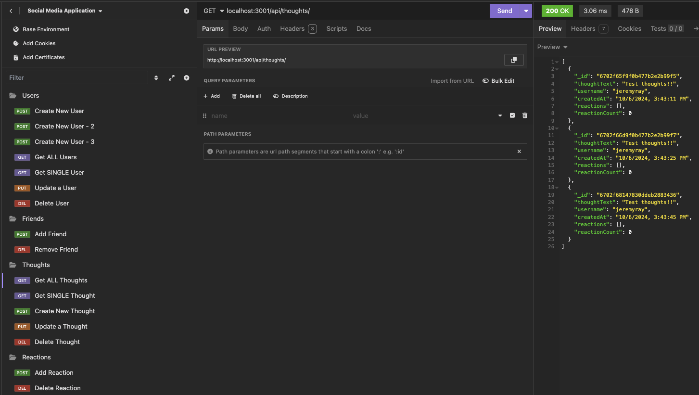

  # My Social Network
  
  ## Table of Contents
  1. [Instructions](#1-instructions)
  2. [Description](#2-description)
  3. [Contribution Guidelines](#3-contribution-guidelines)
  4. [Testing the Application](#4-testing-the-application)
  5. [License](#5-license)
  6. [Questions](#6-questions)

  ## 1. Instructions
  This is the basic backend for a simple social media website. Since this is only the backend, there is no front end visibility built into the application. You will need to have Express, MongoDB/Mongoose, and Insomnia installed to use this code for testing.

  Below is a video demonstrating the use of the application: 
   

  ## 2. Description
  This is the backend for a social media web application where a user is able to create their account, add their own posts/thoughts, add friends to their account, and then add reactions to their content. Since there is not any front end set up for the application, this will require the use of any type of API testing application such as Insomnia in order to view the functionality of the application.  

  ## 3. Contribution Guidelines
  Open contributions are accepted.

  ## 4. Testing the Application
   In order to test the application, you will need to start by installing the package.json dependencies for Express and Mongoose with the "npm i" command in the terminal. Once you have installed these and have Insomnia installed as well, you should be able to run "npm start" in the terminal to start the server, which will allow you to test the routes on Insomnia.

   Since there are many different routes that you are able to test, I recommend creating a collection of each CRUD route in the application so you don't need to manually enter the localhost URL every time. Below is an example of how I structured my layout: 

   

  ## 5. License
  MIT 
  https://opensource.org/licenses/MIT

  ## 6. Questions:
  Contact me with questions at: 
    - Github: *jeremydray* 
    - Email: *jeremydray@gmail.com*
